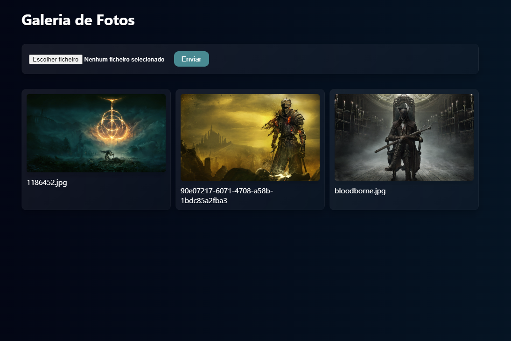

#  **Halloween Responsive Website**

 

## 	&#127919; **About**
Uma Galeria de fotos que faz upload de arquivos em um sevidor externo(firebase).

 

## 📋**My Experience**
Esse projeto me animou muito com as várias possibilidades que o firebase oferece de maneira simples.

## 🔧 **Techs**

* HTML
* CSS
* JavaScript
* React
* Typescript

## &#127775; **Features**
&#10004; Conexão com servidor externo  &#10004; 100% Responsivo

## <a href="https://photo-gallery-drab.vercel.app/">**Clique aqui para visitar o Projéto**</a>

